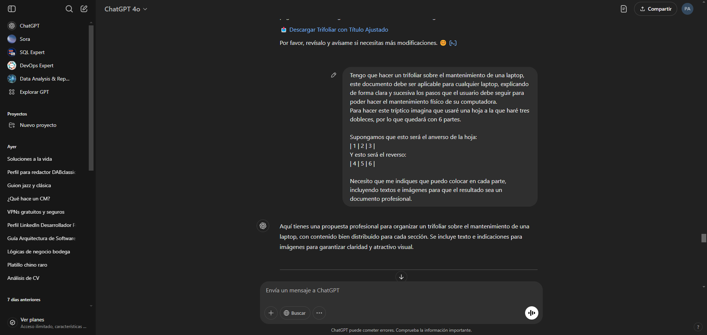
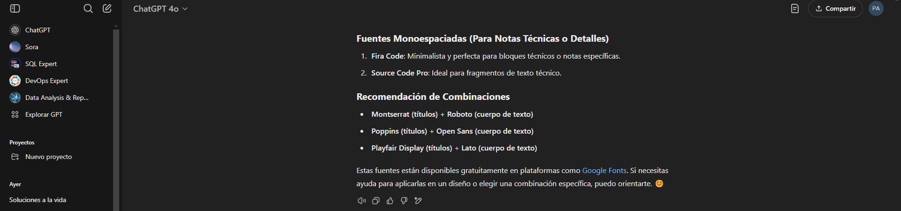

# Proceso Asistido por IA para la Generación de Contenidos Técnicos

El contenido de los manuales y las guías que se encuentran en este espacio fueron generados con la ayuda de Inteligencia Artificial, ya que es una poderosa herramienta que ha cobrado relevancia en los últimos años. Si bien es cierto que la inteligencia artificial automatiza y facilita tareas repetitivas para los seres humanos, las instrucciones que se le proporcionan deben ser claras y específicas para que el contenido generado se adapte a las necesidades de la petición. A continuación se muestran algunos ejemplos de las peticiones realizadas (prompts), que sugieren la forma correcta de realizar las peticiones para que el contenido generado sea de calidad.

## Realización del manual de usuario

## Realización del trifoliar

