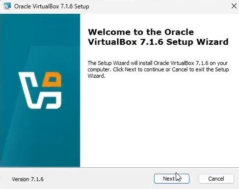
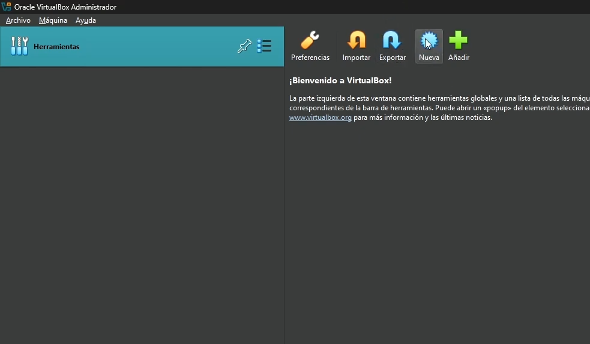
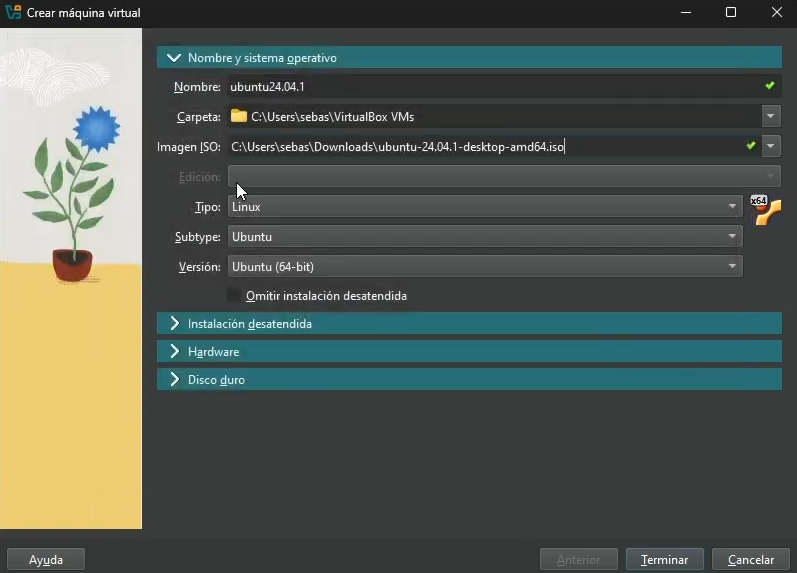
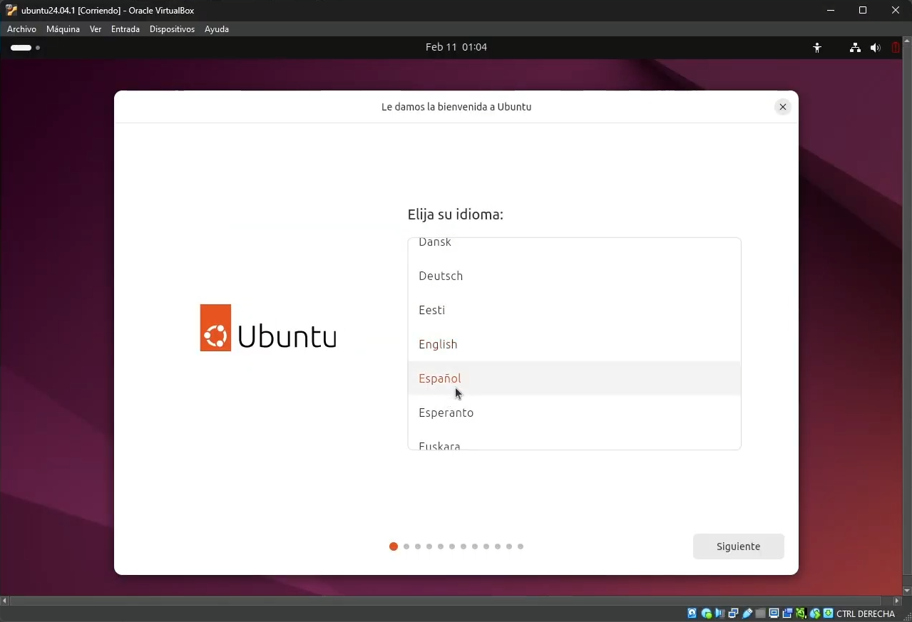

# Manual de Instalación y Uso Básico de Ubuntu en Máquina Virtual

## Instalación de Ubuntu en Máquina Virtual

### Requisitos Previos
Antes de instalar Ubuntu en una máquina virtual, asegúrate de contar con:
- Un equipo con suficiente memoria RAM y espacio en disco.
- Una imagen ISO de Ubuntu (descargable desde [Ubuntu Official Website](https://ubuntu.com/download)).
- Un software de virtualización como **VirtualBox** o **VMware**.

### Paso 1: Descarga e Instalación de VirtualBox
1. Descarga VirtualBox desde su sitio oficial: [https://www.virtualbox.org/](https://www.virtualbox.org/)
2. Ejecuta el instalador y sigue estos pasos:
    - Haz clic en **"Next"** para continuar.
   - En la pantalla de **"Custom Setup"**, deja las opciones predeterminadas o personaliza la instalación según tus necesidades.
   - Haz clic en **"Next"** y luego en **"Install"**.
3. Durante la instalación, es posible que se interrumpa momentáneamente tu conexión de red. Esto ocurre porque VirtualBox instala adaptadores de red virtuales.
4. Una vez finalizada la instalación, abre VirtualBox y verifica que funcione correctamente.



### Paso 2: Creación de la Máquina Virtual
1. Abre VirtualBox y haz clic en **"Nueva"**.
2. Especifica un nombre para la máquina virtual (Ejemplo: "Ubuntu VM").
3. Selecciona **"Linux"** como tipo de sistema operativo y **"Ubuntu (64-bit)"**.
4. Asigna al menos **4 GB de RAM** (recomendado para un mejor rendimiento).
5. Crea un disco duro virtual:
   - Selecciona **VDI (VirtualBox Disk Image)**.
   - Marca **Almacenamiento dinámico** para ahorrar espacio en tu disco físico.
   - Asigna al menos **20 GB de espacio**.



### Paso 3: Configuración de la Imagen ISO
1. Selecciona la máquina virtual creada y haz clic en **"Configuración"**.
2. Dirígete a la pestaña **"Almacenamiento"** y en "Controlador: IDE" agrega la imagen ISO de Ubuntu.
3. Guarda los cambios y cierra la configuración.



### Paso 4: Instalación de Ubuntu
1. Inicia la máquina virtual y selecciona la opción **"Instalar Ubuntu"**.
2. Elige el idioma y la distribución de teclado adecuada.
3. Selecciona **"Instalación normal"** y marca "Descargar actualizaciones".
4. Escoge la opción **"Borrar disco e instalar Ubuntu"** (afecta solo a la máquina virtual).
5. Configura la zona horaria, crea un usuario y establece una contraseña.
6. Espera a que termine la instalación y reinicia la máquina virtual.



## Comandos Básicos en Ubuntu
Una vez instalado Ubuntu, es fundamental conocer los comandos básicos para manejar el sistema.

### 1. Navegación en Archivos y Directorios
- **Listar archivos y directorios:**
  ```bash
  ls
  ```
  - Ejemplo: Si ejecutas `ls` en el directorio `/home/usuario/`, verás una lista de archivos y carpetas dentro de él.
  
- **Cambiar de directorio:**
  ```bash
  cd nombre_del_directorio
  ```
  - Ejemplo: `cd Documentos/` te moverá al directorio "Documentos".

- **Volver al directorio anterior:**
  ```bash
  cd ..
  ```
  - Esto te moverá al directorio padre del actual.

### 2. Ver Contenido de un Directorio
- **Lista detallada de archivos:**
  ```bash
  ls -l
  ```
  - Muestra permisos, propietario, tamaño y fecha de modificación.

- **Lista incluyendo archivos ocultos:**
  ```bash
  ls -a
  ```
  - Muestra también archivos ocultos (los que comienzan con `.`).

### 3. Crear Carpetas
- **Crear un directorio:**
  ```bash
  mkdir nombre_del_directorio
  ```
  - Ejemplo: `mkdir Proyectos` crea la carpeta "Proyectos" en el directorio actual.

### 4. Copiar Archivos y Carpetas
- **Copiar un archivo:**
  ```bash
  cp archivo_origen archivo_destino
  ```
  - Ejemplo: `cp archivo.txt /home/usuario/Documentos/` copiará "archivo.txt" a "Documentos".

- **Copiar un directorio y su contenido:**
  ```bash
  cp -r directorio_origen directorio_destino
  ```

### 5. Mover Archivos y Carpetas
- **Mover un archivo:**
  ```bash
  mv archivo_origen archivo_destino
  ```
  - Ejemplo: `mv notas.txt Escritorio/` moverá "notas.txt" a "Escritorio".

- **Renombrar un archivo:**
  ```bash
  mv nombre_viejo nombre_nuevo
  ```

### 6. Eliminar Archivos y Carpetas
- **Eliminar un archivo:**
  ```bash
  rm nombre_del_archivo
  ```

- **Eliminar un directorio y su contenido:**
  ```bash
  rm -r nombre_del_directorio
  ```

### 7. Acceder como Superusuario
- **Ejecutar comandos como superusuario:**
  ```bash
  sudo comando
  ```

### 8. Cambiar Permisos de Archivos y Directorios
- **Modificar permisos:**
  ```bash
  chmod 755 nombre_del_archivo
  ```
  - `755` significa permisos de lectura y ejecución para todos, y escritura solo para el propietario.

### 9. Crear y Editar Archivos desde la Terminal
- **Crear un archivo vacío:**
  ```bash
  touch nombre_del_archivo.txt
  ```

- **Editar un archivo con nano:**
  ```bash
  nano nombre_del_archivo.txt
  ```

### 10. Instalación de Paquetes desde la Terminal
- **Instalar un paquete:**
  ```bash
  sudo apt install nombre_del_paquete
  ```
  - Ejemplo: `sudo apt install vim` instalará el editor de texto Vim.

### 11. Actualización de Paquetes
- **Actualizar lista de paquetes:**
  ```bash
  sudo apt update
  ```

- **Actualizar todos los paquetes:**
  ```bash
  sudo apt upgrade
  ```

### 12. Eliminación de Paquetes
- **Eliminar un paquete:**
  ```bash
  sudo apt remove nombre_del_paquete
  ```
  - Ejemplo: `sudo apt remove firefox` desinstalará Firefox.

---

Este manual te ayudará a instalar y manejar Ubuntu en una máquina virtual con los comandos más esenciales. Puedes agregar imágenes en los espacios indicados para mejorar la comprensión visual del proceso.