# Manual de Usuario

## Integrantes

- **Christian David Chinchilla Santos** - Carné: 202308227  
- **Eduardo Sebastian Gutierrez Felipe** - Carné: 202300694  

## Introducción

Este documento proporciona una guía detallada sobre el uso de la aplicación, explicando cada una de sus funciones principales y cómo interactuar con la interfaz.

---

## Pantalla de Inicio de Sesión

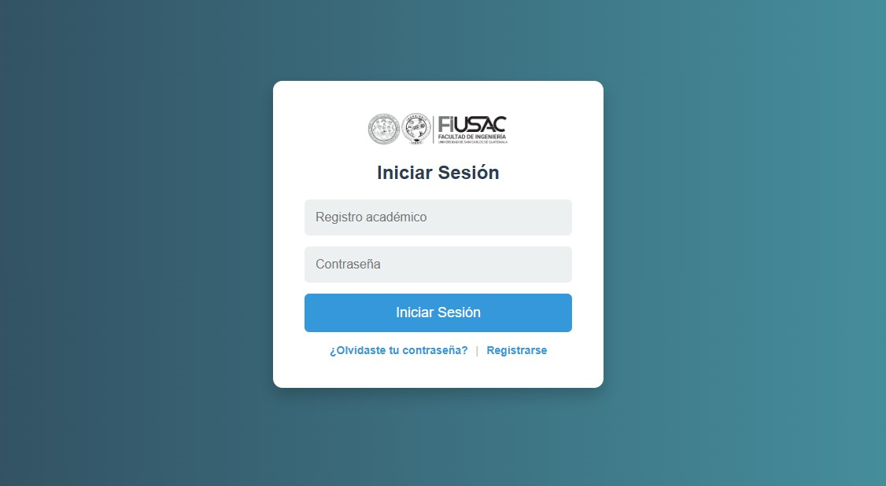

La pantalla de inicio de sesión es la primera vista al abrir la aplicación. Aquí los usuarios pueden autenticarse ingresando su **Registro Académico** y **Contraseña**.

### Opciones disponibles:
- **Registro Académico:** Ingresar el número de registro académico asignado por la universidad.
- **Contraseña:** Introducir la contraseña asociada a la cuenta.
- **Botón "Iniciar Sesión":** Valida los datos ingresados y permite el acceso a la aplicación.
- **"¿Olvidaste tu contraseña?":** Permite recuperar el acceso en caso de olvidar la contraseña.
- **"Registrarse":** Redirige a la página de creación de cuenta.

---

## Pantalla de Crear Cuenta

Esta pantalla permite la creación de una nueva cuenta dentro de la aplicación. Aquí el usuario debe proporcionar su información personal para completar el registro.

### Campos requeridos:
- **Registro Académico:** Número de identificación único asignado a cada estudiante.
- **Nombres:** Nombre completo del usuario.
- **Apellidos:** Apellidos del usuario.
- **Correo Electrónico:** Dirección de correo válida utilizada para la comunicación.
- **Contraseña:** Clave de acceso segura para la cuenta.

### Opciones disponibles:
- **Botón "Registrarse":** Guarda los datos ingresados y crea la cuenta.
- **"¿Ya tienes cuenta? Inicia sesión":** Redirige a la pantalla de inicio de sesión en caso de que el usuario ya esté registrado.

---

## Pantalla de Recuperación de Contraseña

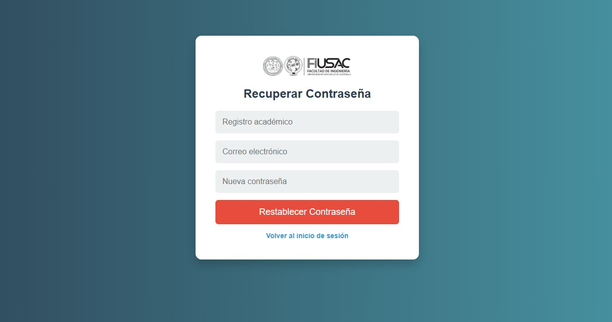

Esta pantalla permite restablecer la contraseña en caso de que el usuario la haya olvidado.

### Campos requeridos:
- **Registro Académico:** Número de identificación único del usuario.
- **Correo Electrónico:** Correo asociado a la cuenta.
- **Nueva Contraseña:** Clave de acceso que reemplazará la anterior.

### Opciones disponibles:
- **Botón "Restablecer Contraseña":** Confirma los datos y actualiza la contraseña en la base de datos.
- **"Volver al inicio de sesión":** Redirige nuevamente a la pantalla de inicio de sesión.

---

## Pantalla de Bienvenida

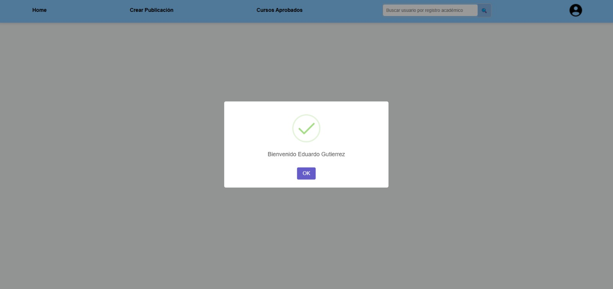

Después de iniciar sesión correctamente, el usuario es recibido con un mensaje de bienvenida personalizado.

### Elementos de la pantalla:
- **Mensaje de Bienvenida:** Indica que el usuario ha ingresado correctamente al sistema.
- **Botón "OK":** Confirma el mensaje y lleva al usuario a la página principal.

En la parte superior de la pantalla se encuentra la barra de navegación, que permite acceder a las siguientes opciones:
- **Home:** Página principal de la aplicación.
- **Crear Publicación:** Permite a los usuarios generar contenido dentro del sistema.
- **Cursos Aprobados:** Muestra los cursos que el usuario ha completado.
- **Barra de Búsqueda:** Facilita la búsqueda de usuarios por su registro académico.
- **Icono de Perfil:** Proporciona acceso a las configuraciones de la cuenta del usuario.

---

## Pantalla de Inicio (Home)

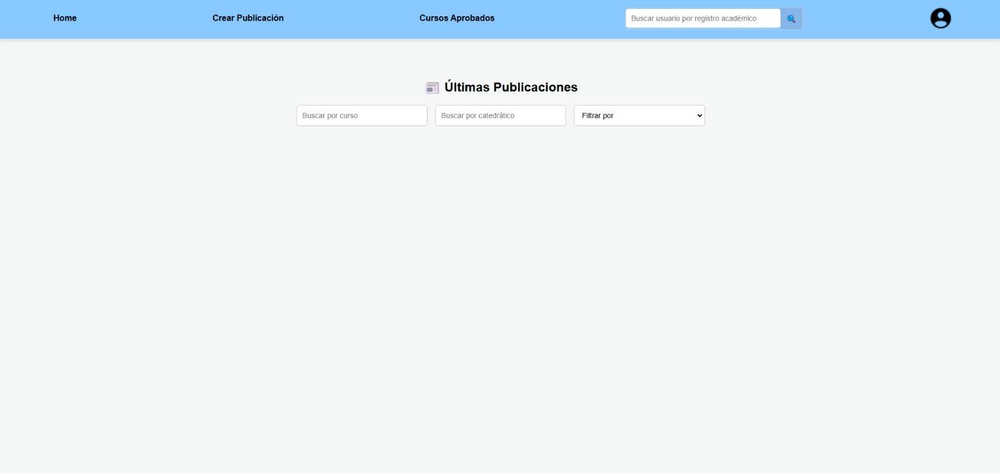

Esta es la pantalla principal de la aplicación, donde se muestran las últimas publicaciones realizadas por los usuarios.

### Elementos de la pantalla:
- **Sección "Últimas Publicaciones":** Muestra las publicaciones más recientes dentro de la plataforma.
- **Filtros de búsqueda:**
  - **Buscar por curso:** Permite filtrar publicaciones relacionadas con un curso específico.
  - **Buscar por catedrático:** Permite encontrar publicaciones relacionadas con un profesor.
  - **Filtrar por:** Desplegable para organizar las publicaciones según diferentes criterios.
- **Barra de Navegación:** Contiene accesos rápidos a:
  - **Home:** Página principal.
  - **Crear Publicación:** Para generar nuevo contenido.
  - **Cursos Aprobados:** Sección con los cursos que el usuario ha completado.
  - **Buscar Usuario:** Campo de búsqueda para encontrar otros usuarios por su registro académico.
  - **Perfil:** Icono que permite acceder a la configuración de usuario.

---

## Pantalla de Creación de Publicación

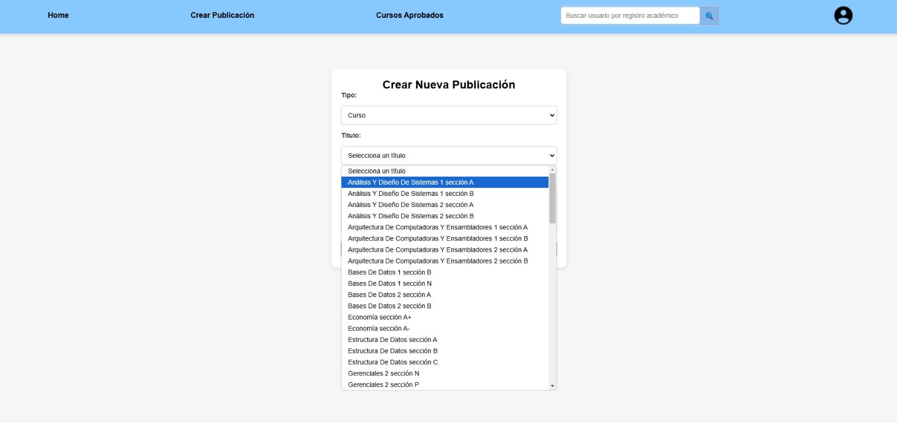

Esta pantalla permite a los usuarios crear nuevas publicaciones dentro de la plataforma.

### Elementos de la pantalla:
- **Selección de tipo de publicación:**
  - Curso: Publicaciones relacionadas con cursos específicos.
  - General: Publicaciones sin categoría específica.
- **Selección de título:** Lista desplegable con los cursos disponibles para relacionar la publicación con uno en particular.
- **Campos de contenido:**
  - **Título:** Permite al usuario ingresar un título personalizado para la publicación.
  - **Mensaje:** Área de texto donde se escribe el contenido de la publicación.
- **Botón "Publicar":** Envía la publicación a la plataforma, haciéndola visible para los demás usuarios.

---

## Pantalla de Creación de Publicación por Catedrático

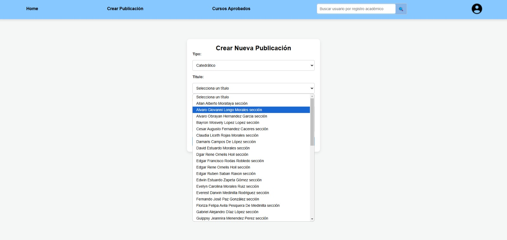

Esta pantalla permite a los usuarios crear publicaciones relacionadas con un **catedrático específico** dentro de la plataforma.

### Elementos de la pantalla:
- **Selección de tipo de publicación:**
  - Curso: Publicaciones sobre cursos específicos.
  - **Catedrático:** Publicaciones sobre profesores.
- **Selección de título:** Lista desplegable con los nombres de los catedráticos disponibles en la plataforma.
- **Campos de contenido:**
  - **Título:** Espacio para ingresar un título personalizado.
  - **Mensaje:** Área de texto donde el usuario puede escribir su publicación.
- **Botón "Publicar":** Publica el mensaje en la plataforma, haciéndolo accesible para los demás usuarios.

---

## Confirmación de Publicación Exitosa

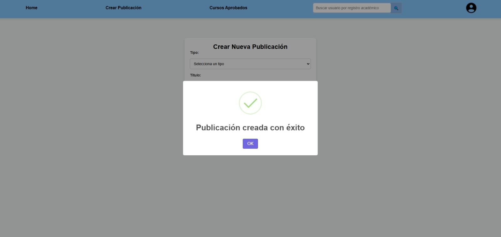

Después de crear una publicación con éxito, el sistema muestra un mensaje de confirmación.

### Elementos de la pantalla:
- **Mensaje de confirmación:** Informa al usuario que su publicación ha sido creada exitosamente.
- **Botón "OK":** Cierra el mensaje y redirige al usuario a la pantalla principal.

---

## Pantalla de Visualización de Publicaciones

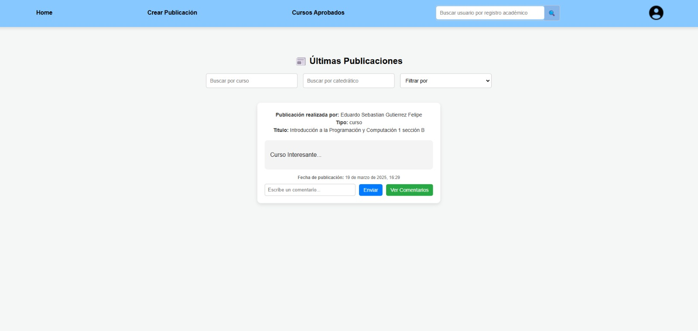

Esta pantalla muestra las publicaciones creadas por los usuarios dentro de la plataforma.

### Elementos de la pantalla:
- **Publicación realizada por:** Muestra el nombre del usuario que creó la publicación.
- **Tipo de publicación:** Indica si la publicación es sobre un curso o un catedrático.
- **Título de la publicación:** Nombre del curso o del catedrático asociado a la publicación.
- **Mensaje de la publicación:** Contenido escrito por el usuario.
- **Fecha de publicación:** Momento en que se publicó el mensaje.
- **Campo de comentarios:** Espacio donde los usuarios pueden escribir respuestas o reacciones a la publicación.
- **Botón "Enviar":** Publica un comentario en la publicación.
- **Botón "Ver Comentarios":** Permite visualizar los comentarios existentes en la publicación.

---
## Pantalla de Cursos Aprobados

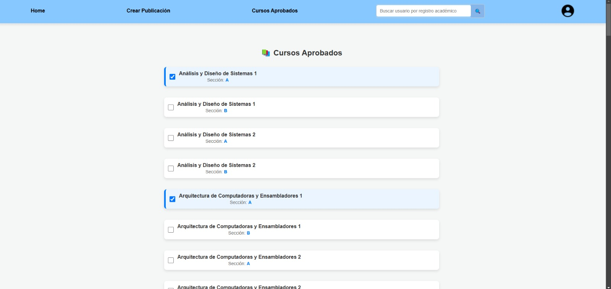

Esta pantalla permite a los usuarios visualizar los cursos que han aprobado dentro del sistema.

### Elementos de la pantalla:
- **Lista de cursos aprobados:** Muestra el nombre y la sección de cada curso que el usuario ha completado.
- **Casillas de selección:** Permiten gestionar los cursos aprobados para futuras referencias.
- **Barra de navegación:**
  - **Home:** Redirige a la pantalla principal.
  - **Crear Publicación:** Permite generar contenido dentro de la plataforma.
  - **Cursos Aprobados:** Sección donde se visualizan los cursos completados.
  - **Buscar Usuario:** Campo de búsqueda para encontrar otros usuarios por su registro académico.
  - **Perfil:** Icono que da acceso a la configuración del usuario.

Los usuarios pueden utilizar esta pantalla para llevar un registro de los cursos que han completado a lo largo de su formación académica.

---

# Pantalla de Perfil de Usuario

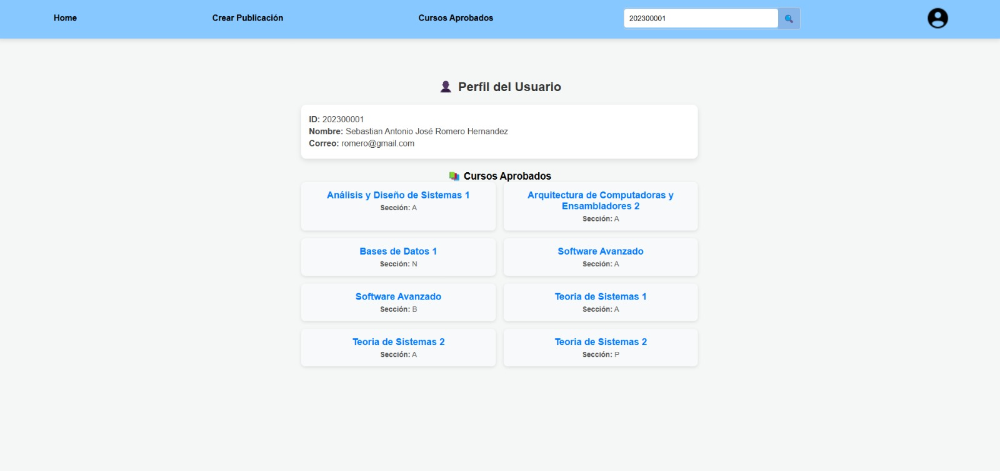

Esta pantalla permite a los usuarios visualizar la información de su perfil y los cursos aprobados.

### Elementos de la pantalla:
- **Información del usuario:**
  - **ID:** Registro académico del usuario.
  - **Nombre:** Nombre completo del usuario.
  - **Correo:** Dirección de correo electrónico asociada a la cuenta.
- **Lista de cursos aprobados:**
  - Muestra los cursos que el usuario ha completado junto con su respectiva sección.

Los usuarios pueden acceder a esta pantalla para consultar su información personal y verificar los cursos que han aprobado.

---

## Menú de Usuario

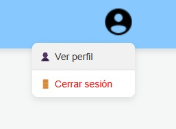

Este menú se despliega al hacer clic en el icono de usuario ubicado en la parte superior derecha de la aplicación.

### Elementos del menú:
- **Ver perfil:**
  - Redirige al usuario a la pantalla de perfil donde puede ver su información personal y los cursos aprobados.
- **Cerrar sesión:**
  - Permite al usuario salir de la aplicación de forma segura, cerrando su sesión activa.

Este menú facilita el acceso rápido a la configuración del perfil y la opción de cerrar sesión de manera eficiente.

---

## Edición de Perfil

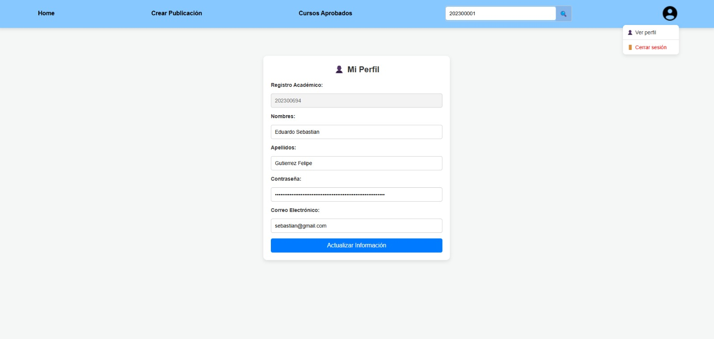

Esta pantalla permite a los usuarios actualizar su información personal dentro del sistema.

### Elementos de la pantalla:
- **Registro Académico:** Muestra el número de identificación del usuario (no editable).
- **Nombres:** Campo para modificar los nombres del usuario.
- **Apellidos:** Campo para modificar los apellidos del usuario.
- **Contraseña:** Campo para actualizar la contraseña del usuario.
- **Correo Electrónico:** Campo para modificar el correo electrónico registrado.
- **Botón "Actualizar Información":** Guarda los cambios realizados en los datos del usuario.

Esta funcionalidad permite a los usuarios mantener su información personal actualizada dentro de la plataforma.

---

## Confirmación de Actualización de Perfil

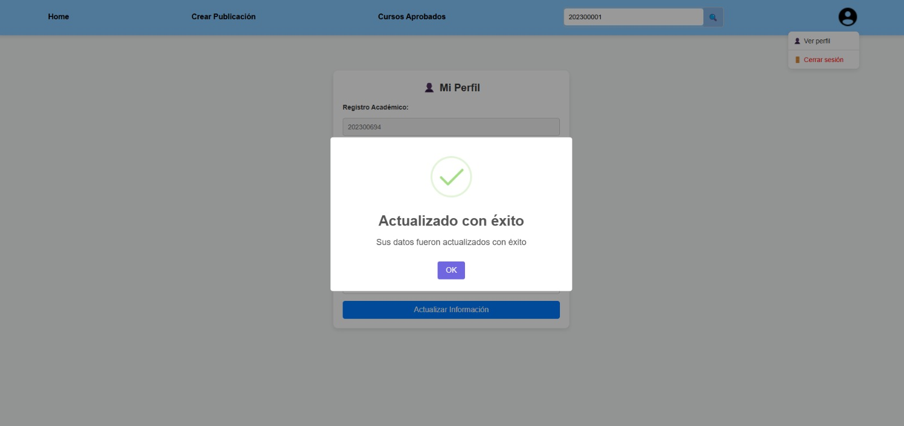

Después de modificar y guardar los datos del perfil, la aplicación muestra un mensaje de confirmación indicando que la actualización fue exitosa.

---

## Confirmación de Publicación de Comentario

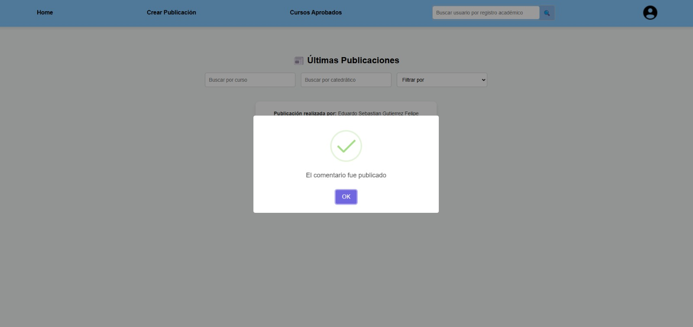

Al realizar un comentario en una publicación dentro de la plataforma, se muestra un mensaje de confirmación para indicar que el comentario ha sido publicado con éxito.

---

## Confirmación de Publicación de Comentario

Al realizar un comentario en una publicación dentro de la plataforma, se muestra un mensaje de confirmación para indicar que el comentario ha sido publicado con éxito.

---

## Últimas Publicaciones

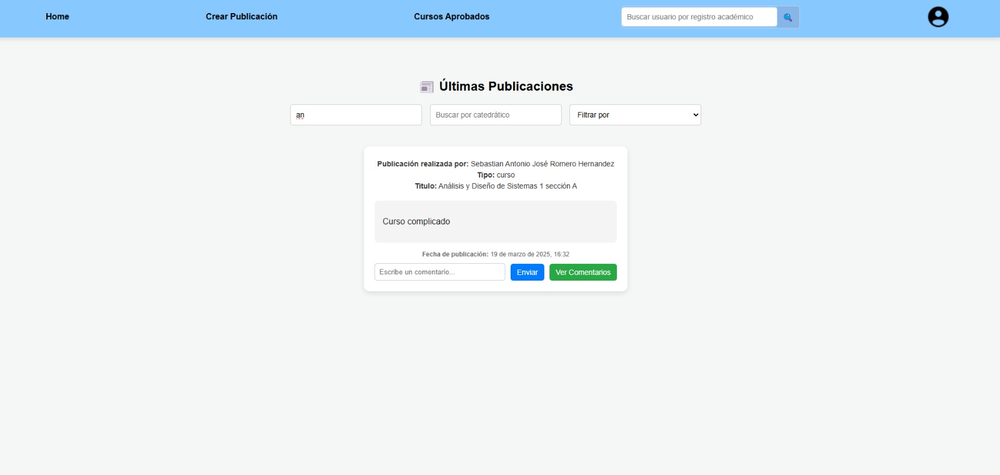

Esta sección muestra las publicaciones más recientes realizadas por los usuarios sobre distintos cursos y catedráticos.

### Elementos de la pantalla:
- **Campo de búsqueda por curso:** Permite filtrar publicaciones relacionadas con un curso específico.
- **Campo de búsqueda por catedrático:** Posibilita la búsqueda de publicaciones hechas sobre un profesor en particular.
- **Filtro de publicaciones:** Ayuda a organizar las publicaciones según distintos criterios.
- **Publicaciones recientes:**
  - **Autor:** Nombre del usuario que realizó la publicación.
  - **Tipo:** Indica si la publicación es sobre un curso o un catedrático.
  - **Título:** Nombre del curso o catedrático mencionado en la publicación.
  - **Contenido:** Comentario o información publicada por el usuario.
  - **Fecha de publicación:** Indica el momento en que la publicación fue realizada.
  - **Opciones de interacción:**
    - **Escribir un comentario:** Campo donde los usuarios pueden añadir respuestas o comentarios adicionales a la publicación.
    - **Botón "Enviar":** Guarda el comentario realizado en la publicación.
    - **Botón "Ver Comentarios":** Permite visualizar los comentarios que otros usuarios han realizado en esa publicación.

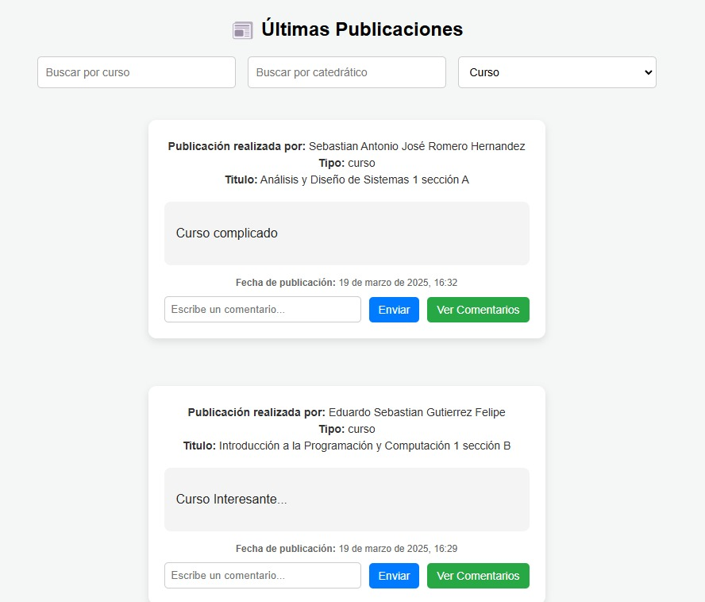
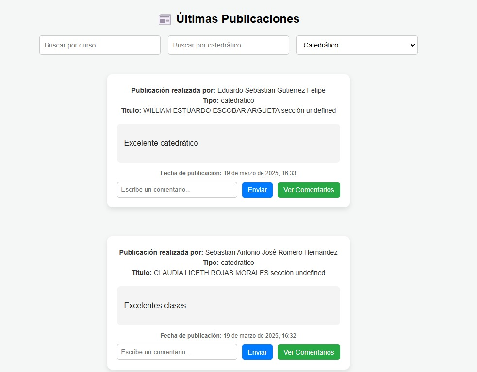

Tambien vemos comentarios respecto a los catedraticos y sobre el mismo curso. Esta sección facilita la interacción entre los usuarios, fomentando la discusión y el intercambio de información sobre cursos y catedráticos dentro de la plataforma.
---